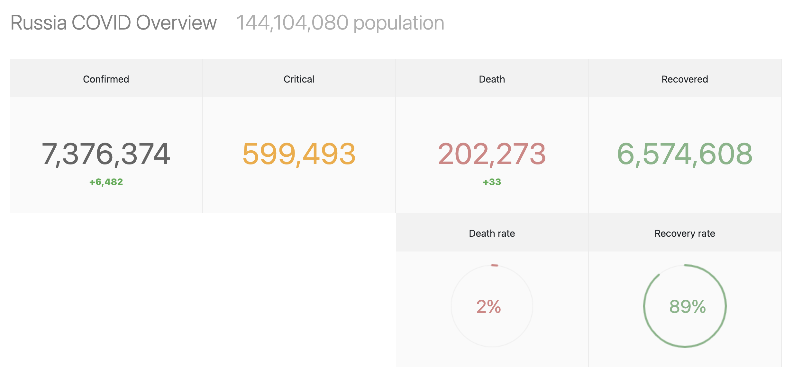

# Microservices

Microservices which provides information on statistics on COVID-19 for any country using third-party resource [corona-api.com](http://corona-api.com) and [restcountries.com](https://restcountries.com)
## Getting started
### 1. Build project
```shell
mvn clean install
```
### 2.1 Launch with CLI
In root (ex00) folder:
```shell
java -jar {SERVICE_NAME}/target/{*.jar}
```
Microservices order:
1. service-discovery
2. covid
3. countries
4. aggregator
5. api-gateway

### 2.2 Launch in Docker
In root folder:
```shell
docker-compose up -d
```
Stop and down containers with images removing:
```shell
docker-compose stop
docker-compose down --rmi all
```
## Usage
Eureka dashboard: `localhost:8761`
### API

```shell
curl -X GET http://localhost:8080/information_management/countries/RU
```
where **RU** is any country code

To see the visualization of JSON, follow `localhost:8080/information_management/countries/RU/overview` in browser
